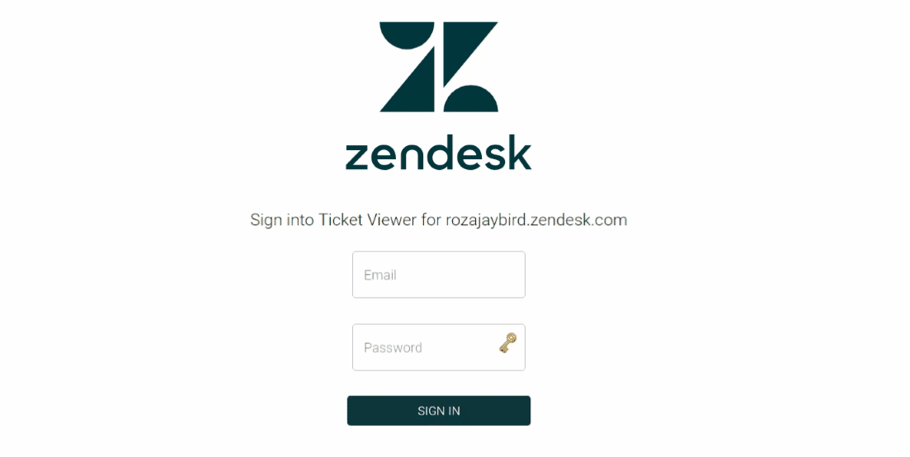
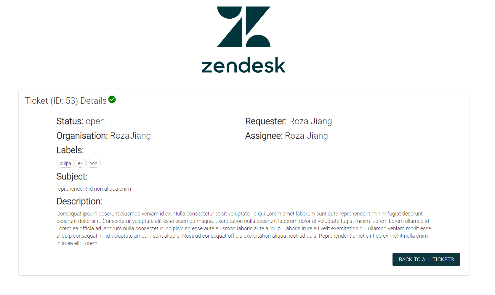

# TicketViewer
Solution for the coding challenge Ticket Viewer

This project was bootstrapped with [Create React App](https://github.com/facebook/create-react-app).

## Instructions on running the project
In order to run the project first open up the server folder

### `cd server`

Install relevant node modules

### `npm install express node-fetch base-64 cors`

Run the node server file

### `node app.js`

Then open a new terminal back to the same main directory

Open the client folder

### `cd client`

Install relevant node modules

### `npm install`

Run the application by

### `npm run start`

If all goes well the application should automatically pop up your default browser window.
If that does not pop up, goto [http://localhost:3000](http://localhost:3000) to view the app

Type any random email and password and you should see an error pop up.

If the correct password and email is entered it will load the tickets table

Click on any of the table entries to bring up single ticket view.

## Instructions on testing the project

In order to test the front end you need to open the client folder and run the below command
### npm run test

In order to test the backend server you need to configure the globals.json file to include the email and password. (this file should have been attached in the submission email) **Please make sure the globals.json is in the root directory of server first before running the below command.**

### `newman run postman_collection.json -g globals.json`

### 
## Post challenge rambles

This has been a really fun project. I really enjoyed it. My approach to this problem was to design a end to end lifecycle of the application first then decide on the different UI components needed. Then after coding up the UI components it was pretty much string everything up through state management and passing api information from backend to frontend.

After coding up a MVP, I started writing the tests (nope unfortunately this was not TDD..). For the server side, since there were mostly apis I decided to write tests in postman then export it to my project through newman. I tested for invalidly typed inputs, invalid inputs that generates no record and authentication errors. This helped me to go back to the front end side to account for more promise error exceptions.

For the UI tests, only a few checking if component renders is tested. 

## Areas of improvement
### Usability
The current application is limited to one subdomain. In order to increase usability there should be another page for user to enter their own subdomain.

### Security
Currently the username and password is passed as path urls to backend then added as headers to the api call. I believe this.... is not... secure.... (I know :sob: ). Perhaps using some kind of token management method would have been more secure.

### Performance
More effort should be added on this aspect for performance. Currently all tickets are loaded on the click of sign in button. A better way of doing this is either using pagination parameters for the api or use node streams.

